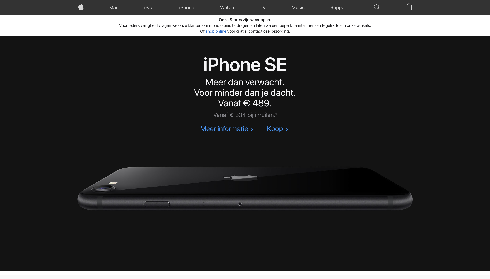
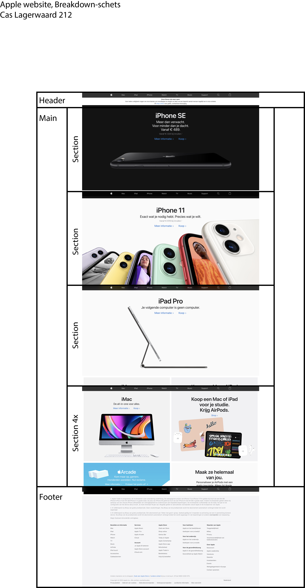
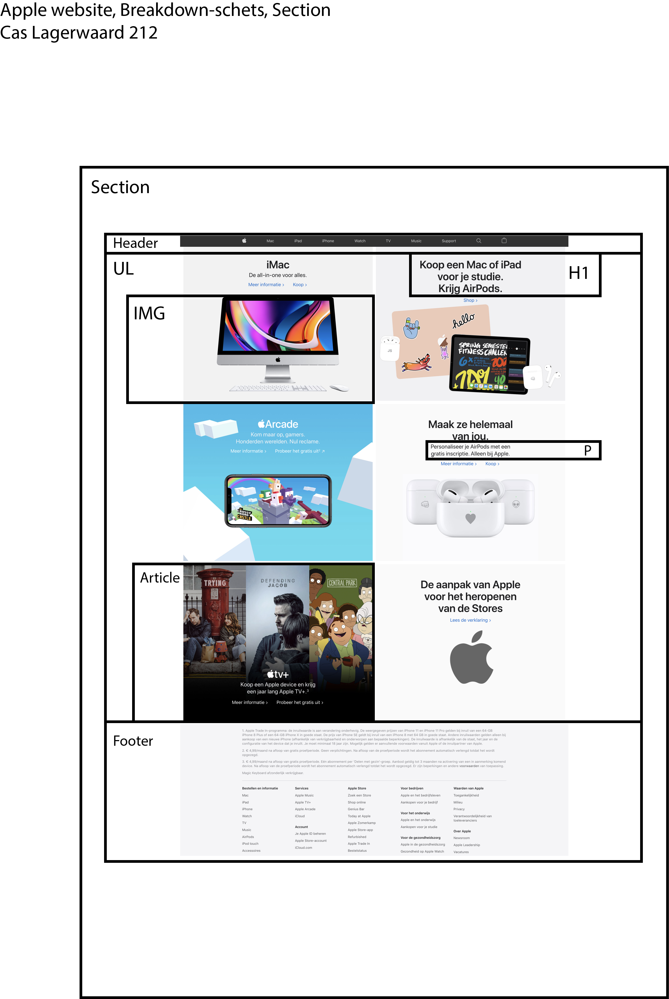

# Procesverslag
**Auteur:** Cas Lagerwaard

Markdown cheat cheet: [Hulp bij het schrijven van Markdown](https://github.com/adam-p/markdown-here/wiki/Markdown-Cheatsheet). Nb. de standaardstructuur en de spartaanse opmaak zijn helemaal prima. Het gaat om de inhoud van je procesverslag. Besteedt de tijd voor pracht en praal aan je website.

## Bronnenlijst
1. https://www.w3schools.com/
2. https://css-tricks.com/
3. https://www.youtube.com/watch?v=br-0i3U1VCA
4. https://www.youtube.com/watch?v=PwWHL3RyQgk&t=229s

## Eindgesprek (week 7/8)

-dit ging goed & dit was lastig-

Ik heb mijn eindgesprek nog niet gehad maar over het proces:
Ik ben over het algemeen erg blij met wat ik heb geleerd dit vak,
ik ben super blij met hoe ik mijn website responsive heb gemaakt. De mediaquerys vond ik er tof om mee te werken. Wat iets minder ging was toch echt wel de Navbar. Dan heb ik het wel over het maken van het hamburger menu met de navbar, dit heb ik ook met een mediaquery gedaan maar ik vond het best ingewikkeld. Een inzicht waar ik ben achtergekomen is dat ik wel eerder aan de bel moet trekken als ik hulp nodig heb, ik probeer het teveel zelf te doen. Ik heb nu een paar keer Sam om hulp gevraagd en een keer gebeld en dat klaarde een hoop op. Soms merk ik dat ik te lang bezig ben en dat ik de kleinste dingen over het hoofd zie zoals een spatie vergeten of niet goed afsluiten.

(images/screenshot99.png)
(images/screenshots98.png)

## Voortgang 3 (week 6)

-same as voortgang 1-

veel problemen met de nav bar, responsive design ging wel erg goed, veel gewerkt met classes, hierdoor heb ik bijvoorbeeld de CSS van pagina 2 anders gemaakt.

## Voortgang 2 (week 5)

Ik liep vast met de navbar, en ik had niet echt een
goed idee hoe ik het hamburger menu moest gaan maken, de grid maken
van de website ging wel erg goed.

## Voortgang 1 (week 3)

### Stand van zaken

-dit ging goed & dit was lastig-
Er ging niet heel veel mis, ik was vooral bezig met
html en css zoveel mogelijk laten lijken op de echte apple 
webstite.

**Screenshot(s):**

-screenshot(s) van hoe ver je bent-

### Agenda voor meeting

Hoe kan ik in mijn P element een enter doen? 
Hoe krijg ik images over het hele scherm en zelfs er buiten?
Hoe houd ik mijn tekst goed in het midden? dat was nu met margin en padding..
De background color gaat niet helemaal over de pagina?
de website blijft veranderen hoe maak ik die nu goed na?

### Verslag van meeting

-na afloop snel uitkomsten vastleggen-

## Intake (week 1)

**Je startniveau:** Rood

**Je focus:** Surface plane

**Je opdracht:** https://www.apple.com/nl/?afid=p238%7CsOAYctFNC-dc_mtid_187079nc38483_pcrid_431760065195_pgrid_13316338141_&cid=aos-nl-kwgo-brand--slid--bran-product-

**Screenshot(s):**

**Breakdown-schets(en):**

